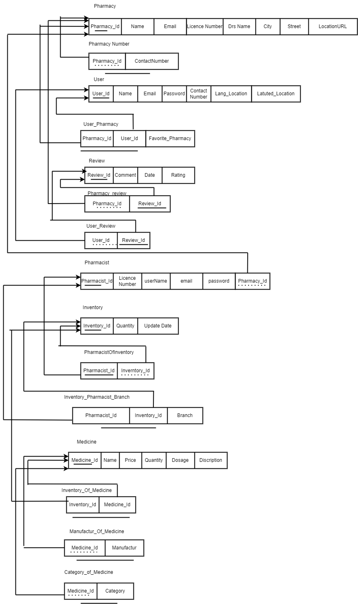
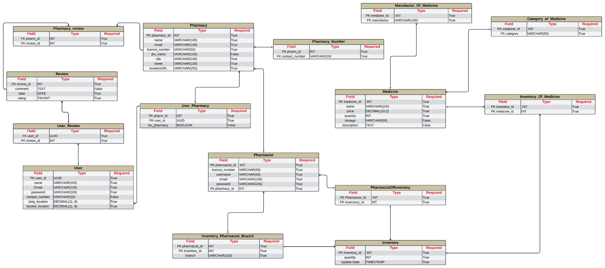
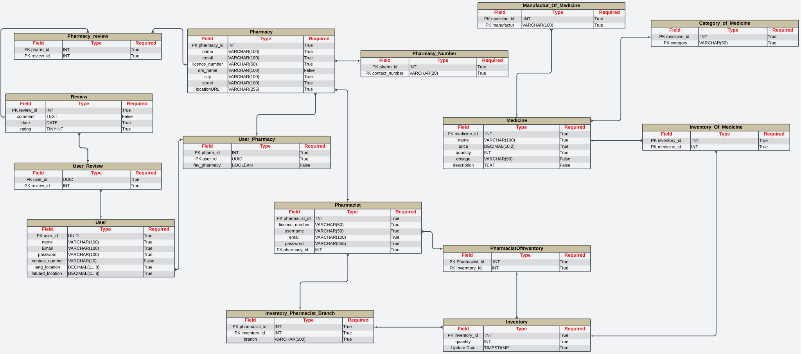

# DAWAYA ERD (Entity-Relationship Diagram)

## Overview

**Dawaya** is an application designed to help users easily find nearby pharmacies that have the medicines they need. This README provides a comprehensive overview of the database structure and relationships between entities in the Dawaya system.

## Table of Contents

- [DAWAYA ERD (Entity-Relationship Diagram)](#dawaya-erd-entity-relationship-diagram)
  - [Overview](#overview)
  - [Table of Contents](#table-of-contents)
  - [Entities](#entities)
    - [Pharmacy](#pharmacy)
    - [Pharmacist](#pharmacist)
    - [User](#user)
    - [Inventory](#inventory)
    - [Branch](#branch)
    - [Medicine](#medicine)
    - [Review](#review)
  - [ERD Diagrams](#erd-diagrams)
  - [Mapping](#mapping)
  - [Schema](#schema)

## Entities

### Pharmacy

- **Attributes**: ID (unique), Profile photo (logo), Name, Email
- **Relationships**:
  - Can employ multiple pharmacists
  - Has multiple inventory items
  - Can have multiple reviews

### Pharmacist

- **Attributes**: Pharmacist ID (unique), Full name, Email, Password, License Number
- **Relationships**:
  - Works at only one pharmacy
  - Manages branch's inventory

### User

- **Attributes**: ID (unique), Full name, Email, Password, Phone Number, Address (city, street name, locationURL)
- **Relationships**:
  - Can leave one review per pharmacy
  - Can add multiple pharmacies to favorites list

### Inventory

- **Attributes**: Inventory ID (unique), Update date, Quantity
- **Relationships**:
  - Refers to many medicines
  - Belongs to one pharmacy

### Branch

- **Attributes**: ID (unique), Pharmacy name, Address (city, street, locationURL), License number, Photos, Contact numbers, Opening hours, Doctor's name
- **Relationships**:
  - Has multiple pharmacists (at least one)
  - Has an inventory record

### Medicine

- **Attributes**: Medicine ID (unique), Name, Description, Dosage, Manufacturer, Category, Price, Available Quantity
- **Relationships**:
  - Can be listed in multiple inventory records
  - Belongs to one category

### Review

- **Attributes**: Review ID (unique), Rating (1-5), Comment, Review Date
- **Relationships**:
  - Written by one user
  - For one pharmacy

## ERD Diagrams

For a detailed view of the entity relationships, please refer to the ERD diagrams above.

## Mapping

The mapping diagram provides a visual representation of how entities are related and connected within the Dawaya system.

## Schema

The schema diagrams above illustrate the structure of the database tables and their relationships.
